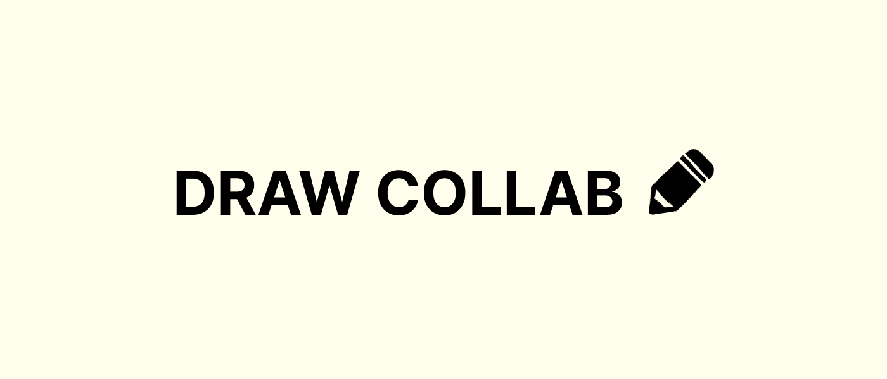
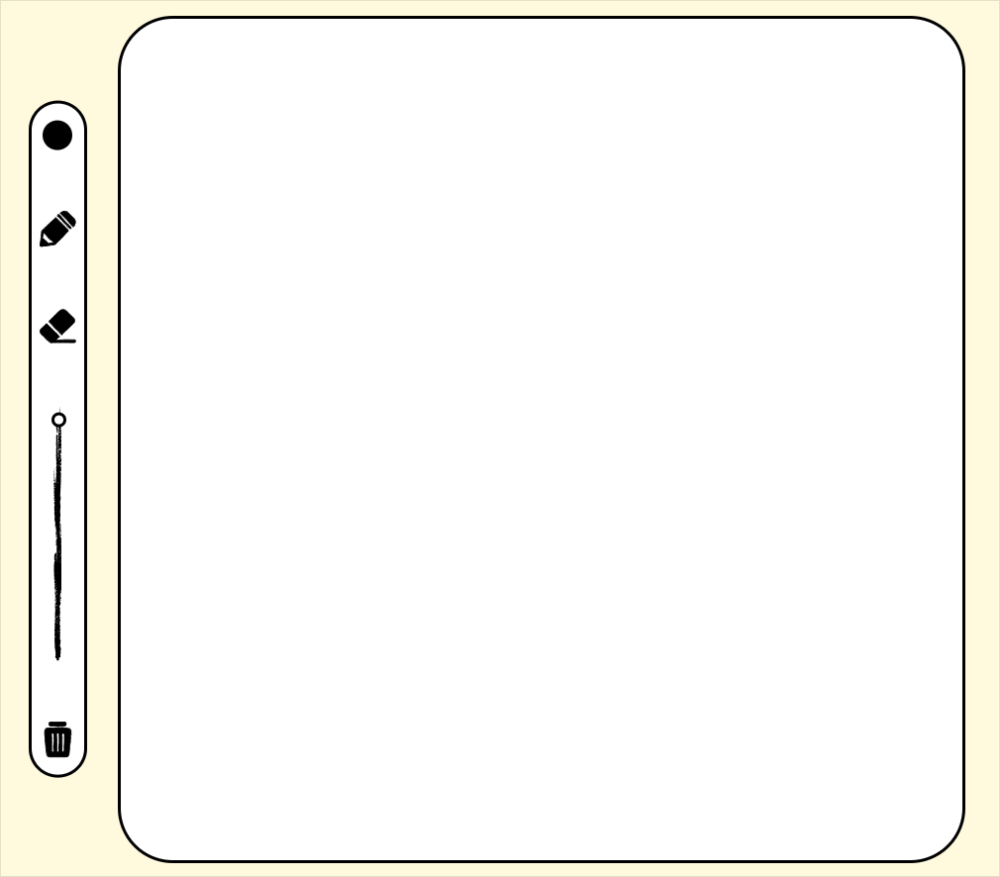

  
  
  
  

# Draw Collab

Draw Collab is a real-time collaborative web drawing application that allows multiple users to create and interact on a shared canvas simultaneously. Built using Socket.IO, the app synchronizes drawing actions across all connected clients, enabling users to draw, erase, change colors, adjust brush sizes, and clear the canvas in real time. The project demonstrates practical implementation of WebSocket-based communication, event-driven programming, and client-server synchronization to create a seamless multi-user creative experience directly in the browser.

## Installation

Try out the website with this link:

    https://collaborative-drawing-app-client.vercel.app/

please take note that the server might cold start at the beginning, so the first sketches might not be saved

or, clone the repository

    git clone https://github.com/francogabrieloliveros/collaborative-drawing-app-client.git

    npm install

    npm run dev

locally, sockets will not be used as it requires the database api link. Feel free to locally run your own server by cloning this [repository](https://github.com/francogabrieloliveros/collaborative-drawing-app-server).

## Usage

### Color Picker

By clicking the color picker, you will open your own browser's default color picker. The picked color will be the color of the brush in the next few sketches.

### Pen

The pen enables you to draw lines with varying sizes and color in the canvas. This utilizes the color picker and the slider.

### Eraser

The width of the eraser depend on the slider value. Since the canvas is single layered, all drawings will be affected by the eraser.

### Slider

By default the slider value is 10. Changing this will change the line width of the pen and the eraser, depending on which one is selected.

### Delete

Clicking the delete button will clear the entire canvas locally and in the server. With this, the canvas will be cleared for all the users.

## Additional Notes

- Please wait a few seconds before drawing as the server might cold start on initial access. With that, the first few drawings might not be saved on the server.
- The website works on mobile, so please try that out too!!
- Currently, there are no visual representation for the size of the pen and eraser.
- There are no rooms yet in this socket, all people who will try out the site will access the same canvas.
- The alignment and sizes of the buttons might differ from browser-to-browser, especially Chrome vs Firefox.
